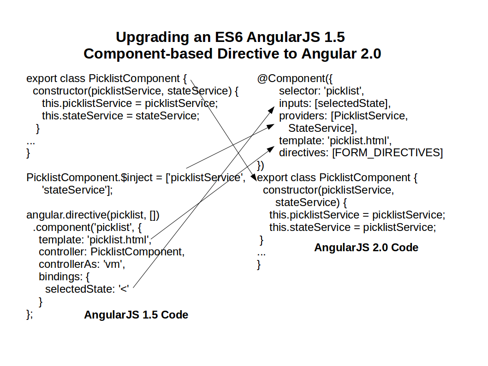
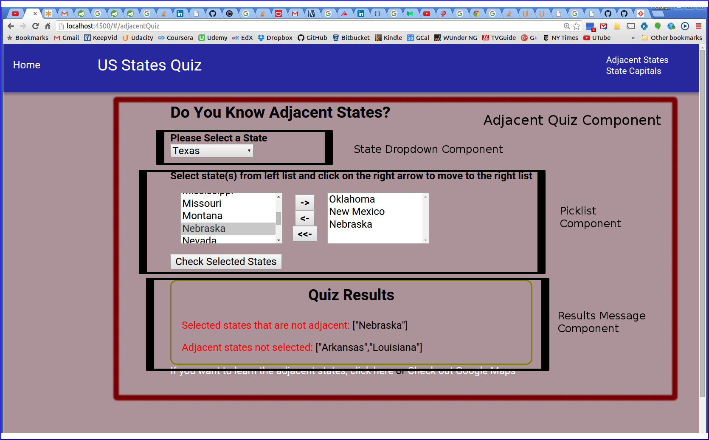
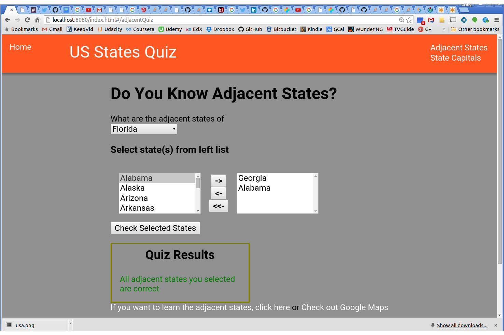
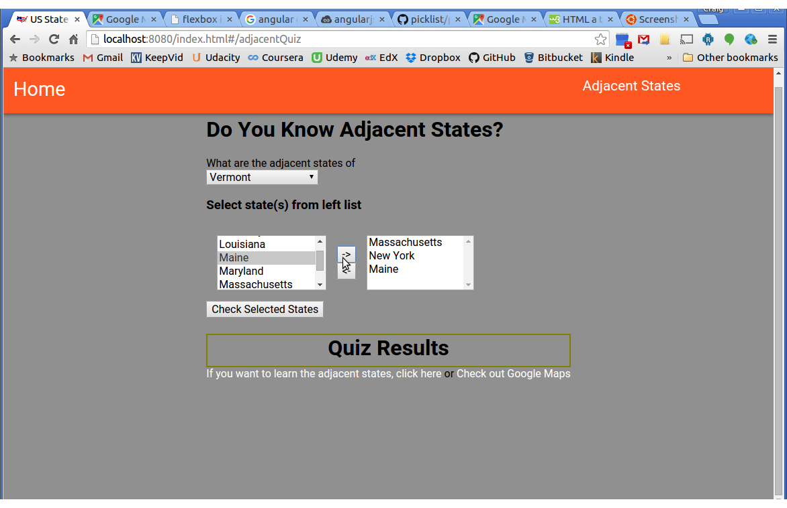

# state-geo: Test your knowledge of the US states #

The programming is done as an AngularJS 1 app using a component-based directive architecture similar to Angular 2.0 to make it easy to 
upgrade to the new version. This is accomplished by following these guidelines: 
* ES6/2015 is used throughout since Angular 2 is written in the new JavaScript version. Babel is used to transpile the code to ES5.
* The component() method created in AngularJS 1.5 is used instead of the directive() method.
* All directive's tag attributes are set as 'bindings' properties of the component object. These attributes will correspond to values of the inputs and outputs array properties set in the @Component decorator in Angular 2.
* Each directive's controller is implemented in a separate ES6/2015 class. They will become the Angular 2 component class when the app is upgraded.
* The component's object argument sets the controllerAs property (or uses the default $ctrl as the controller's alias). This allows avoidance of $scope since is not used in Angular 2.
* Replaced $watch() calls with RxJS Observable subscription since $watch is on the chopping block for Angular 2.
* AngularJS 1 services are implemented as ES6/2015 classes. They will port directly to Angular 2.
* Standalone Angular controllers are NOT used in the app since they are going away in Angular 2.

An example of how to to upgrade a ES6/2015 AngularJS 1.5 component-based directive to Angular 2.0 is shown below:

  
The build system for this application uses gulp with webpack (and babel). Stylus is used as the CSS preprocessor with Jeet to aid layout. If you want to run the program locally,
follow the following steps:

```bash
# clone this repo
git clone https://github.com/cdoremus/state-geo-angular.git 

# change directory to the repo
cd state-geo-angular

# make sure you have the global npm packages installed
npm install -g gulp karma protractor

# install the repo's dependencues
npm install

# build the app
gulp

# start the server in a separate window
gulp serve 
```  
The application can then be accessed by browsing to <a href="http://localhost:4500/">http://localhost:4500/</a>.

Unit and end-to-end functional tests can be run using the following commands:

```bash
#Run unit tests run using Karma
npm tests

#Run end-to-end functional tests using Protractor
npm run e2e 
```  

The templates folder contains templates for new components built inside of a new folder under client/app. They can be created with this command:
gulp component --name newComponentName

This project builds a bundle.js that is put in a destination folder (dist). The application can also be configured to use a RESTful
Java web service and MongoDB (see state-geo-server-spring).

A running version of the application can be found at <a href="http://cdoremus.github.io/state-geo-quiz/" target="_blank">http://cdoremus.github.io/state-geo-quiz/</a>.

Screenshot of Adjacent States Quiz with Erroneous Results and Components outlined on the screen:


Screenshot of Adjacent States Quiz with Correct Results:


Screenshot of State Capitals Quiz with Correct Results:

